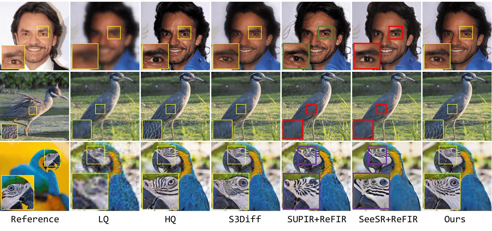
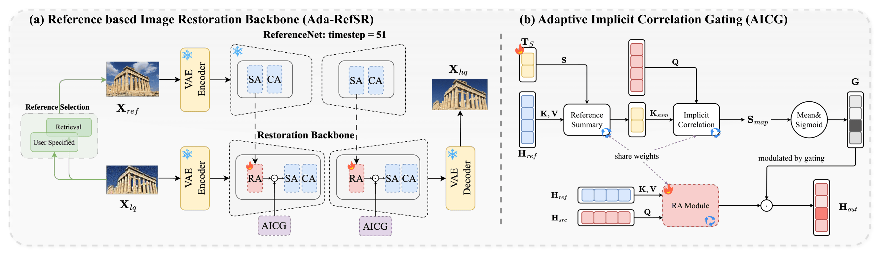

<!-- # Ada-RefSR -->
<h1 align="center">[ICLR 2026]Trust but Verify: Adaptive Conditioning for Reference-Based Diffusion Super-Resolution via Implicit Reference Correlation Modeling</h1>
<div align="center">
<hr>

[Yuan Wang]()<sup>*1,2</sup>&nbsp; [Yuhao Wan]()<sup>1</sup>&nbsp; [Siming Zheng]()<sup>2</sup>&nbsp;
[Bo Li]()<sup>2</sup>&nbsp;  [Qibin Hou]()<sup>1</sup>&nbsp; [Peng-Tao Jiang]()<sup>2,†</sup>&nbsp;


<sup>1</sup> VCIP, School of Computer Science, Nankai University &nbsp;&nbsp;<sup>2</sup> vivo Mobile Communication Co., Ltd&nbsp;&nbsp; 

<sup>*</sup> Work done when interning at vivo. <sup>†</sup> Corresponding authors.  


<h4>

<a href="https://arxiv.org/abs/2602.01864">📄 arXiv Paper</a> &nbsp; 
<a href="">🌐 Project Page</a> &nbsp; 
<a href="https://huggingface.co/hangfrieddays/AdaRefSR">🤗 Hugging Face Models</a>
</h4>

</div>

<div align="center">

</div>
Figure 1. Visual comparisons: S3Diff is a single-image generation network, and ReFIR is the current SOTA for reference based restoration. Our method not only outperforms ReFIR in leveraging reference details but also shows stronger robustness against degradations than S3Diff.


<div align="center">

</div>
Figure 2. Overview of our framework. It comprises two components: (a) a reference-based restoration backbone, and (b) a
correlation-aware adaptive gating mechanism.


## ✨ Highlights

🎯 **AICG: Adaptive Implicit Correlation Gating.** We propose **AICG**, a lightweight implicit correlation gating module that directly addresses a key challenge in RefSR: how to reliably use reference information to restore LQ inputs degraded by real-world artifacts. By reusing existing projections in the attention module and introducing only a few learnable summary tokens, AICG implicitly models LQ–Ref correlations while adding negligible computational overhead.


🚀 **Ada-RefSR: Strong Generalization, Robustness, and Speed.** Built upon AICG, **Ada-RefSR** achieves stable reference-based enhancement across diverse tasks and degradation scenarios. Its single-step diffusion design provides over **30× speedup** compared to multi-step RefSR baselines, enabling fast and robust SR in both aligned and mismatched reference conditions.


## 🛠️ 1. Environment Setup

The code is developed using **Python 3.10** and **PyTorch**.

```bash
# Create and activate environment
conda create -n adarefsr python=3.10
conda activate adarefsr

# Install dependencies
pip install -r ./requirements.txt

```

## 📦 2. Pretrained Weights

Please download the following weights and place them in the `./models` directory.

| Component | Source / Link | Config Parameter |
| :--- | :--- | :--- |
| **SD Turbo** | [stabilityai/sd-turbo](https://huggingface.co/stabilityai/sd-turbo) | `sd_path` |
| **S3Diff (Backbone)** | [ArcticHare105/S3Diff](https://github.com/ArcticHare105/S3Diff) | `pretrained_backbone_path` |
| **RAM & DAPE** | [RAM Swin-L](https://huggingface.co/spaces/xinyu1205/recognize-anything/blob/main/ram_swin_large_14m.pth) / [SeeSR (DAPE)](https://github.com/cswry/SeeSR) | `ram_path` / `dape_path` |
| **Ada-RefSR (Ours)** | [Download Link](https://huggingface.co/hangfrieddays/AdaRefSR) | `pretrained_ref_gen_path` |


> **Path Configuration**: After downloading, please ensure the local paths are correctly updated in `./my_utils/training_utils.py` and `./my_utils/testing_utils.py` to match your directory structure.


## 📂 3. Dataset Preparation

### 📊 Training Datasets
1. **General SR Datasets**: 
   - Download **DIV2K** ([Link](https://huggingface.co/datasets/yangtao9009/DIV2K)), **DIV8K** ([Link](https://huggingface.co/datasets/yangtao9009/DIV8K)), and **Flickr2K** ([Link](https://huggingface.co/datasets/yangtao9009/Flickr2K)).
   - Preparation: Follow the index format in `./datasets/info/*.txt`. 
   - Organization: Process the data according to the structure defined in `./data/train`.

2. **Face specific reference SR Dataset**: 
   - Download **CelebFaceRef-HQ** ([Link](https://huggingface.co/datasets/hangfrieddays/CelebFaceRef-HQ)).
   - Processing: Run the provided script to partition the dataset:
     ```bash
     python ./data/create_celebref.py
     ```

### 🧪 Validation Datasets
- Download the full four RefSR testing datasets from Hugging Face ([Link](https://huggingface.co/datasets/hangfrieddays/adarefsr_test_data)) and save it into the `./data/test` directory.


### 🦅 Other Datasets
- For those interested in specialized domains, such as fine-grained retrieval and restoration, our Bird Retrieval Dataset is available here: ([Link](https://huggingface.co/datasets/hangfrieddays/bird_retrieval))

## 🚀 4. Usage

### 🎨 Quick Start (Demo)
You can quickly test our model on your own images using the provided demo script. This script automatically handles image resizing (to multiples of 8) and color alignment.

```bash
# Basic usage
python ./demo.py \
    --config "./configs/demo_config.yaml" \
    --lq_path "./assets/pic/lq.png" \
    --ref_path "./assets/pic/ref.png" \
    --output_path "./assets/pic/result.png"
```


### ⚙️ Training
Ensure the training datasets are prepared (see Section 3). Training configurations for both real and virtual scenarios are located in the shell scripts:

```bash
cd ./main_code/train
# Training includes weights and config information
sh run_training.sh
```

### 🧪 Validation & Evaluation
We provide specific validation scripts for different benchmarks. Navigate to the corresponding directories to run evaluations:

```bash
# CUFED5
cd ./main_code/test/cufed5 && sh run_validation.sh

# WRSR
cd ./main_code/test/wrsr && sh run_validation.sh

# Bird
cd ./main_code/test/bird && sh run_validation.sh

# Face
cd ./main_code/test/face && sh run_validation.sh
```

## 📊 5. GPU Memory and Inference Speed

The following performance metrics for **Ada-RefSR** were measured on a **single NVIDIA A40 GPU**. Our method is specifically optimized for high-resolution generation, achieving high-fidelity restoration with remarkable computational efficiency.

* **At $512 \times 512$ resolution**: Ada-RefSR requires **12.66 GB** of GPU memory and completes inference in just **0.41 seconds**.
* **At $1024 \times 1024$ resolution**: Ada-RefSR requires **15.54 GB** of GPU memory with an inference time of only **1.35 seconds**.


## 🙏 Acknowledgements

This project is built upon the following excellent open-source repositories:

* [S3Diff](https://github.com/ArcticHare105/S3Diff): The base generative backbone for our framework.
* [ReFIR](https://github.com/csguoh/ReFIR): For reference-based logic and benchmark implementations.
* [SeeSR](https://github.com/cswry/SeeSR): For the RAM and DAPE-based semantic conditioning.
* [Stability AI](https://github.com/Stability-AI/generative-models): For the foundational SD-Turbo model.
* [diffusers](https://github.com/huggingface/diffusers): For the powerful and flexible diffusion model training and inference suite.

We thank the authors of these projects for their great work and for making their code available to the community, which has significantly facilitated our research.


## 📜 Citation

If you find our work or code useful for your research, please cite:

```latex
@misc{wang2026trustverifyadaptiveconditioning,
      title={Trust but Verify: Adaptive Conditioning for Reference-Based Diffusion Super-Resolution via Implicit Reference Correlation Modeling}, 
      author={Yuan Wang and Yuhao Wan and Siming Zheng and Bo Li and Qibin Hou and Peng-Tao Jiang},
      year={2026},
      eprint={2602.01864},
      archivePrefix={arXiv},
      primaryClass={cs.CV},
      url={https://arxiv.org/abs/2602.01864}, 
}
```
